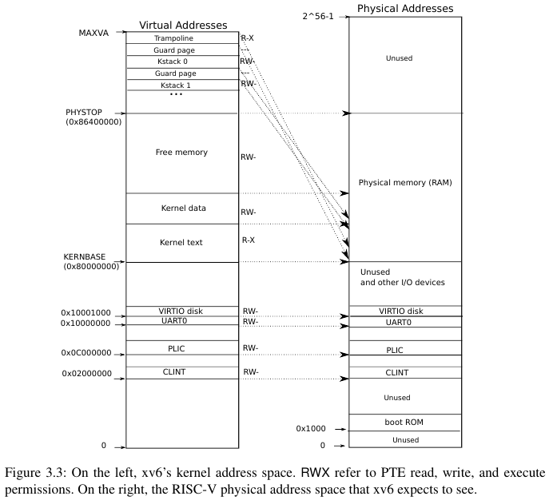

- [Voorbereiding](#voorbereiding)
- [Repository](#repository)
- [Physical memory allocator](#physical-memory-allocator)
- [Locking](#locking)
- [Deadlocks](#deadlocks)
- [Lock contention](#lock-contention)
- [Lock contention verminderen](#lock-contention-verminderen)

# Voorbereiding

Ter voorbereiding van deze oefenzitting word je verwacht:

- De oefenzitting over [traps][oz traps] te hebben voltooid;
- Hoofdstukken 6 en 7 van het [xv6 boek][xv6 book] te hebben gelezen;
- Sectie 3.5 van het xv6 boek nog eens opgefrist te hebben.

# Repository

We beginnen deze oefenzitting in [onze xv6 repository][xv6-riscv bss].
Pas later zal je een eigen repository nodig hebben voor de permanente evaluatie.
Je kan onze repository op deze manier clonen:
```shell
git clone https://github.com/besturingssystemen/xv6-riscv.git
```

# Physical memory allocator

In de oefenzitting over virtual memory hebben we gezien hoe de mappings van virtuele naar fysieke adressen opgesteld worden in xv6.
De implementatie van lazy allocation bouwde hier op verder en introduceerde de functie [`kalloc`][kalloc] om fysieke frames to alloceren.
We gaan nu de werking van `kalloc`, de _physical memory allocator_ van xv6, in detail bekijken en de performantie op multi-processor systemen proberen te verbeteren.

De taak van een physical memory allocator (vanaf nu kortweg `kalloc` genoemd) is, zoals de naam doet vermoeden, het beheer van het fysieke geheugen in het systeem.
Telkens de kernel meer geheugen nodig heeft, zal deze `kalloc` eerst vragen om een nieuwe fysieke frame, en indien nodig vervolgens dit frame mappen op een virtuele page.

> :bulb: Herinner je dat xv6 een _identity mapping_ maakt voor het gehele beschikbare fysieke geheugen.
> Dit wilt zeggen dat binnen de kernel fysieke adressen overeenkomen met virtuele adressen.
> Als de kernel `kalloc` gebruikt voor eigen datastructuren, zal het dus niet nodig zijn een nieuwe mapping toe te voegen.

Een aantal voorbeelden van wanneer dit gebeurt:

- Bij het inladen van een nieuwe executable door [`exec`][exec] wordt [`uvmalloc` gebruikt][exec uvmalloc] om user pages aan te maken.
  [`uvmalloc`][uvmalloc] [alloceert een frame via `kalloc`][uvmalloc kalloc] en [mapt deze via `mappages`][uvmalloc mappages].
- Gelijkaardig, [`sbrk`][sys_sbrk] roept [`growproc`][growproc] op om de heap van een proces te laten groeien.
  Deze functie roept op zijn beurt weer `uvmalloc` op.
- Wanneer er nieuwe page tables aangemaakt moeten worden, zal [`walk`][walk] weer [gebruik maken van `kalloc`][walk kalloc] om hier een frame voor te voorzien.

> **:question: Vind andere plekken in de kernel waar `kalloc` gebruikt wordt en en probeer te begrijpen waarom.
> Je kan het volgende commando in een Linux terminal gebruiken om alle voorkomens van de string "kalloc" te vinden in alle `.c` files:**
>
> ```bash
> grep -n kalloc kernel/*.c
> ```

Maar hoe beheert `kalloc` het fysieke geheugen precies?
Om deze vraag te beantwoorden, moeten we eerst bepalen _wat_ `kalloc` precies beheert.
Herinner je de volgende figuur uit het xv6 boek:



De rechterhelft toont de _memory map_ van de _physical address space_ waar xv6 gebruik van kan maken.
Zoals je kan zien, wordt slechts een gedeelte van deze address space gebruikt voor physical memory (RAM).
De rest van de address space wordt ofwel niet gebruikt, ofwel in beslag genomen door _memory-mapped I/O_ (MMIO) devices (CLINT, PLIC, UART, VIRTIO).
MMIO is een techniek om te communiceren met devices: loads en stores naar MMIO regios zullen niet in het geheugen terechtkomen maar worden afgehandeld door devices.

> :bulb: Een memory map is zeer systeem-afhankelijk.
> De bovenstaande is de memory map zoals die door de qemu emulator voorzien wordt.
> Op andere systemen kan deze volledig anders zijn en zal xv6 dus niet meteen werken.
> Vaak voorzien systemen een manier om de memory map te achterhalen maar dit wordt niet gebruikt door xv6.
> De memory map die xv6 verwacht is _hardcoded_ in [`memlayout.h`][memlayout.h].

> :bulb: Er gebeuren dus twee verschillende adres mappings door de hardware:
>
> - Virtuele adressen worden eerst op fysieke adressen gemapt door de MMU;
> - Deze fysieke adressen worden vervolgens door de memory controller op RAM of andere devices gemapt.
>
> De tweede mapping is meestal niet onder controle van de kernel en wordt als een gegeven beschouwd.

De figuur toont dat het fysieke geheugen gemapt is vanaf adres `0x80000000`.
Dit adres wordt [`KERNBASE`][KERNBASE] genoemd in xv6.
xv6 gaat er verder van uit dat er 128MiB RAM gemapt is vanaf dit adres.
Dit wilt zeggen dat het einde van het RAM geheugen valt op adres `KERNBASE + 128MiB`.
Dit adres, `0x88000000`, wordt [`PHYSTOP`][PHYSTOP] genoemd (merk op dat de figuur een fout adres aangeeft).

De kernel kan het fysieke geheugen tussen `[KERNBASE, PHYSTOP)` beheren zoals het zelf wil.
Een gedeelte wordt in beslag genomen door de code en statische data van de kernel en de rest wordt dynamisch beheerd door `kalloc`.
xv6 laadt de kernel in het geheugen vanaf `KERNBASE` en definieert een symbool genaamd [`end`][end] om het einde van de kernel aan te geven.
`kalloc` beheert dus het geheugen tussen `[end, PHYSTOP)`.

Nu we weten _wat_ er beheerd wordt, kunnen we bekijken _hoe_ het beheerd wordt.
Laten we eerst de interface die `kalloc` aanbiedt bespreken:

- [`void* kalloc()`][kalloc]: Alloceert één frame en returnt het fysieke adres.
- [`void kfree(void* pa)`][kfree]. Geeft het frame op fysiek adres `pa` vrij.
  Vanaf dit moment is dit frame weer beschikbaar voor `kalloc`.

> **:question: Verklaar waarom `kalloc` niet _minder_ dan één frame kan alloceren.**

`kalloc` moet dus op de één of andere manier bijhouden welke frames vrij zijn, en welke in gebruik zijn.
De keuze om alle allocaties een vaste grootte van één frame te geven maakt dit een relatief eenvoudig probleem.
De standaard techniek voor het implementeren van dit type allocator (vaak een _memory pool_ genoemd) is een _free list_: een linked list van vrije frames.

Deze linked list wordt in xv6 voorgesteld door [`struct run`][struct run] en een pointer naar het eerste element van deze list wordt opgeslagen in de globale variabele [`kmem.freelist`][kmem.freelist].
Opvallend aan deze `struct run` is dat het _enkel_ een `next` pointer bevat, _geen_ data zoals je verwacht in een typische linked list implementatie.
De data in dit geval zijn de frames en om geen extra geheugen te moeten gebruiken voor de linked list, wordt de `struct run` _in_ de frames geplaatst.
De frames in de free list zijn immers niet in gebruik dus is het geen probleem om hier de nodige metadata (de `next` pointer) voor de linked list in op te slaan.

`kalloc` zal het begin van de frames gebruiken om een `struct run` in op te slaan.
Dit kan in C simpelweg door een adres te casten naar een `struct run`.
De volgende code voegt bijvoorbeeld een frame op adres `pa` toe aan de free list:

```c
struct run* r = (struct run*)pa; // Interpret the memory at pa as a struct run
r->next = kmem.freelist;
kmem.freelist = r;
```

De linked list die door `kalloc` gebruikt wordt, kan "grafisch" dus als volgt voorgesteld worden (zoals meestal bij linked lists wordt het einde aangeven door een `next` pointer die op 0 staat):

```ascii
kmem.freelist
      |
      v             |-----------v
+-   -+------+-   -+------+-   -+------+-   -+
|     |n     |     |n     |     |0     |     |
| ... |e ... | ... |e ... | ... |0 ... | ... |
|     |x     |     |x     |     |0     |     |
|     |t     |     |t     |     |0     |     |
+-    +------+-   -+------+-   -+------+-   -+
       |-----------^            \--v--/
                                 frame
```

> **:question: Je hebt nu genoeg informatie om de werking `kalloc` te begrijpen als we het gebruik van locks nog even buiten beschouwing laten.
> Bekijk en verklaar [`kalloc`][kalloc], [`kfree`][kfree] en [`kinit`][kinit] (de initialisatie van `kalloc` via [`freerange`][freerange]).**

# Locking

xv6 ondersteunt _multiprocessor_ systemen.
Dit wil zeggen dat meerdere processoren _tegelijkertijd_ code aan het uitvoeren zijn.
Deze code kan tot verschillende processen behoren maar het kan ook gebeuren dat meerdere processoren tegelijkertijd kernelcode aan het uitvoeren zijn.
Vanaf het moment dat data structuren in de kernel door meerdere processoren gelijktijdig gebruikt worden, kunnen er problemen ontstaan.

> :warning: Synchronizatieproblemen kunnen optreden zelfs zonder multiprocessor systeem. Wanneer twee processen een datastructuur delen en de kernel op willekeurige momenten wisselt tussen deze processen, lijkt het voor de processen alsof ze tegelijkertijd uitgevoerd worden, met standaard synchronizatieproblemen tot gevolg. In kernel space heb je hier op een single core processor minder snel last van, aangezien er maar één kernel is, maar de problematiek komt zelfs dan nog steeds voor. Traps kunnen kernel-code op willekeurige momenten onderbreken waardoor deze code in feite "in parallel" wordt uitgevoerd.

Neem bijvoorbeeld de volgende vereenvoudigde versie van `kalloc`:

```c
void* kalloc()
{
  // 1: Take a pointer to the first free frame
  struct run* r = kmem.freelist;

  if (r != 0) {
    // 2: If we still had a free frame, make freelist point to the next one
    kmem.freelist = r->next;
  }

  // 3: Return address of first free frame
  return (void*)r;
}
```

Stel je nu voor dat twee processoren `kalloc` tegelijkertijd uitvoeren.
Na het uitvoeren van stap 1 zullen ze beiden een lokale variabele `r` hebben die de waarde van `kmem.freelist` bevat (het adres van het eerste vrije frame).
Essentieel aan het probleem is dat `r` op beide processoren _dezelfde_ waarde zal hebben.
In stap 2 passen ze beide `kmem.freelist` aan naar `r->next` wat hier geen groot probleem is aangezien `r` dezelfde waarde heeft.
Stap 3 geeft op beide processoren het adres van hetzelfde frame terug aan de oproeper van `kalloc`.
We zitten nu dus in de situatie waar twee verschillende processoren hetzelfde frame gaan gebruiken voor verschillende doeleinden.
Stel je bijvoorbeeld voor dat één processor `exec` aan het uitvoeren was en de ander `sbrk`; hetzelfde frame zal dus gebruikt worden voor de code van één proces en voor de heap van een ander.

> **:question: Laten we eens bekijken wat er in de praktijk gebeurt als we geen locks zouden hebben in `kalloc`.**
>
> 1. **Haal de calls naar `acquire` en `release` weg uit [`kalloc`][kalloc] en run de `usertests`.
     Verklaar het resultaat.<sup>1</sup>**
> 2. **Doe nu hetzelfde voor `kfree` maar denk eerst na over wat er mis zou kunnen lopen.
     Is het gebrek aan locks in `kfree` even gevaarlijk als in `kalloc`?**
>
> :bulb: <sup>1</sup> Eén van de dingen die concurrency (het tegelijkertijd uitvoeren van code) zo moeilijk maakt, is dat het vaak _non-deterministisch_ is.
> De bovenstaande beschrijving van wat er mis kan gaan met `kalloc` zal enkel gebeuren als er inderdaad twee of meerdere processoren ongeveer tegelijkertijd `kalloc` uitvoeren.
> Niets garandeert dat dit altijd gebeurt.
> Het kan dus zijn dat je `usertests` meerdere keren moet uitvoeren voordat je tegen een probleem aanloopt.

Om dit probleem op te lossen, moeten we er voor zorgen dat er maar één processor tegelijkertijd `kmem.freelist` kan manipuleren.
Dit typische _critical section_ probleem wordt in `kalloc` opgelost via _spinlocks_.

Een spinlock in xv6 wordt voorgesteld door een [`struct spinlock`][struct spinlock].
De belangrijkste variabele in deze struct is `locked`, een integer die aangeeft of er momenteel een processor in de critical section aan het uitvoeren is.
De volgende operaties worden aangeboden voor spinlocks:

- [`void acquire(struct spinlock* lk)`][acquire]: Wacht (_busy waiting_) tot `lk` niet meer `locked` is, zet `locked` en return.
  Deze functie wordt gebruikt om een critical section binnen te gaan.
- [`void release(struct spinlock* lk)`][release]: Zet `locked` op 0.
  Deze functie wordt gebruikt om een critical section te verlaten.

In principe voert `acquire` dus de volgende code uit:

```c
void acquire(struct spinlock* lk)
{
  while (lk->locked != 0) {
    // Busy waiting
  }

  lk->locked = 1;
}

```

Hier hebben we echter hetzelfde probleem als met de eerder getoonde implementatie van `kalloc`: wat als twee processoren tegelijkertijd `acquire` uitvoeren?
In dit geval kan het gebeuren dat beide processoren `lk->locked` als 0 lezen en dus voorbij de loop geraken.
Dit zorgt dus voor twee processoren in de critical section wat we net wilden vermijden me het gebruik van spinlocks.

Zoals beschreven in sectie 6.4 van het Operating System Concepts boek, kan dit opgelost worden met een atomische `TestAndSet` instructie.
Op RISC-V heet deze instructie `amoswap` en de GCC compiler biedt een functie genaamd `__sync_lock_test_and_set` aan om deze instructie gemakkelijk te gebruiken.
De functie zet atomisch de waarde van een integer en geeft de oude waarde terug.
Hiermee kunnen we `acquire` juist implementeren:

```c
void acquire(struct spinlock* lk)
{
  // Atomically set lk->locked to 1 and return its old value
  while (__sync_lock_test_and_set(&lk->locked, 1) != 0) {
    // Busy waiting
  }
}
```

De `release` functie zet in principe `locked` simpelweg op 0.
Ook hier moet ervoor gezorgd worden dat deze assignment atomisch gebeurt:

```c
void release(struct spinlock* lk)
{
  // Atomic version of "lk->locked = 0"
  __sync_lock_release(&lk->locked);
}
```

> :bulb: De implementaties van [`acquire`][acquire] en [`release`][release] zijn in de praktijk nog iets complexer.
> Zo wordt de `__sync_synchronize` GCC functie gebruikt om ervoor te zorgen dat, onder andere, load en store instructies _voor_ `acquire` niet door bepaalde optimizaties tot _na_ `acquire` verplaatst worden.
> De commentaren in deze functies en sectie 6.6 van het xv6 boek gaan hier wat dieper op in.

> **:question: Bekijk en verklaar het gebruik van `acquire` en `release` in [`kalloc`][kalloc] en [`kfree`][kfree].**

# Deadlocks

Spinlocks zorgen ervoor dat een processor soms moeten wachten op een andere processor bij het binnengaan van een critial section.
Wat als meerdere processors _op elkaar_ moeten wachten?
Stel je voor dat de volgende twee functies door verschillende processors uitgevoerd worden:

```c
void cpu0()
{
  acquire(&lock_a);
  acquire(&lock_b);
  // Critical section
  release(&lock_b);
  release(&lock_a);
}

void cpu1()
{
  acquire(&lock_b);
  acquire(&lock_a);
  // Critical section
  release(&lock_a);
  release(&lock_b);
}
```

Het zou kunnen gebeuren dat de instructies in de volgende volgorde uitgevoerd worden:
```ascii
   cpu0              | cpu1
   ------------------|------------------
1: acquire(&lock_a); |
2:                   | acquire(&lock_b);
3:                   | acquire(&lock_a);
4: acquire(&lock_b); |
```
In stap 3 zal `cpu1` moeten wachten op `cpu0` omdat `lock_a` genomen werd door `cpu0` in stap 1.
Tegelijkertijd zal `cpu0` in stap 4 moeten wachten op `cpu1` door `lock_b`.
Er zal nu geen voortgang meer gemaakt kunnen worden omdat beide processors op elkaar aan het wachten zijn.
Dit wordt een _deadlock_ genoemd.

Deadlocks kunnen voorkomen wanneer een processor _op hetzelfde moment_ meerdere spinlocks nodig heeft.
Als een andere processor dezelfde spinlocks ook nodig heeft, kan er een deadlock ontstaan wanneer de verschillende processors de locks in een andere volgorde proberen te krijgen.

Er is daarom een relatief eenvoudige vuistregel om deadlocks te voorkomen: zorg voor een consistente _lock ordering_.
Als je er voor zorgt dat wanneer er meerdere locks nodig zijn alle processors deze locks in dezelfde volgorde proberen te krijgen, zullen er geen deadlocks voor kunnen komen.

> **:question: Overtuig jezelf dat een consistente lock ordering het probleem in het bovenstaande voorbeeld oplost.**

> :bulb: Het is je misschien opgevallen dat er zelfs met één lock een deadlock kan optreden: wanneer dezelfde processor een tweede keer eenzelfde lock probeert te krijgen.
> Aangezien deze situatie niet voor zou mogen komen in correcte code, zal xv6 in dit geval simpelweg [`panic` oproepen][spinlock holding panic].

> :bulb: Deadlocks zijn vaak zeer moeilijk te debuggen omdat je programma gewoon niets meer doet.
> Je kan echter [GDB][gdb] gebruiken om meer informatie te krijgen.
> Op het moment dat xv6 vast zit en je vermoedt dat er een deadlock is, typ je <kbd>CTRL</kbd>+<kbd>C</kbd>, dit zorgt ervoor dat alle processors stoppen met uitvoeren.
> Je kan nu de staat van elke processor bekijken met het commando `info threads`.
> Dit toont een lijst met alle processors en de functie waarin ze op dit moment aan het uitvoeren waren.
> Als er een deadlock was, zal je zien dat minstens twee processors `acquire` aan het uitvoeren waren.
> Je kan nu naar een specifieke processor switchen via `thread id` (waar je `id` vervangt door de Id in de `info threads` output) om daar in detail te bekijken wat er aan de hand is (bijvoorbeeld via het `backtrace` commando).

# Lock contention

> :warning: Vanaf nu werk je verder in je individuele repository.
> Maak deze [hier][classroom] aan voor je verder gaat met de oefenzitting.

Het doel van spinlocks is dus de uitvoering van critical sections door meerdere processoren te _serializeren_.
Met anderen woorden, terwijl een processor een critical section aan het uitvoeren is, zullen de andere processoren moeten wachten.
Alhoewel dit de correctheidsproblemen van `kalloc` oplost, heeft het een impact op de performantie: op elk moment zal slechts één processor een frame kunnen alloceren.
Andere processoren die op hetzelfde moment een frame nodig hebben, zullen moeten wachten en geen nuttige instructie kunnen uitvoeren.

_Lock contention_ is de situatie waar meerdere processoren tegelijk dezelfde critical section binnen willen gaan en dus `acquire` oproepen op dezelfde spinlock.
Hoe vaker dit voorkomt, hoe groter de impact op de performantie zal zijn.
Een manier om dit te kwantificeren is om het aantal iteraties in de `while` loop van `acquire` te tellen; dit is een maat voor de hoeveelheid nutteloze cycles uitgevoerd door processoren.

Om lock contention in xv6 te kunnen meten, hebben we spinlocks uitgebreid met [twee tellers][spinlock counters]: `num_acquires` [telt][num_acquires count] het aantal keer dat `acquire` werd opgeroepen per spinlock en `contention` [telt][contention count] het aantal iteraties in de `while` loop van `acquire`.
Verder zijn er twee kernel functies toegevoegd in `perf.h`:

- [`void perf_register_spinlock(struct spinlock* lock)`][perf_register_spinlock]: Registreer een spinlock om af te printen.
- [`void perf_print_spinlocks()`][perf_print_spinlocks]: Print de contention counters van alle geregistreerde spinlocks.
  Deze functie wordt opgeroepen als je <kbd>CTRL</kbd>+<kbd>L</kbd> typt in de console.

> **:question: Meet de lock contention van de `kalloc` spinlock.**
> 1. **Roep `perf_register_spinlock` op in [`kinit`][kinit] (vergeet `perf.h` niet te `#include`n);**
> 2. **Voer `usertests` uit;**
> 3. **Typ <kbd>CTRL</kbd>+<kbd>L</kbd> in de xv6 console.**
>
> Als het goed is, zul je zien dat de lock contention van `kmem.spinlock` relatief laag is ten opzichte van het totale aantal keer dat `acquire` werd opgeroepen.
> Dit komt omdat `usertests` geen tests uitvoert die op meerdere processoren tegelijkertijd proberen geheugen te alloceren.
> We hebben daarom een nieuwe test, [`stressmem`][stressmem], toegevoegd die drie processen start (xv6 runt standaard op drie processoren) en in elk process in een [loop `sbrk` oproept][alloc_dealloc] om een page te alloceren en dan weer vrij te geven.
>
> **4. Meet de lock contention na het uitvoeren van `stressmem`.**
>
> Nu zul je zien dat de lock contention significant is.

# Lock contention verminderen

Voor de permanente evaluatie gaan we `kalloc` aanpassen om de lock contention te verminderen.
De oorzaak van de hoge contention in `kalloc` is het gebruik van één enkel free list voor alle processoren.
Als elke processor een eigen free list zou hebben, kunnen we de contention (bijna) volledig vermijden.

Er is echter één probleem met dit idee: wat als de free list van een processor leeg is maar een andere processor nog wel vrije frames heeft?
Het zou jammer zijn als `kalloc` om die reden zou falen.
Er moet dus een manier verzonnen worden zodat processors vrije frames van elkaar kunnen "stelen".
Dit is ook de reden dat we de contention nooit volledig kunnen vermijden: processors zullen soms op elkaar moeten wachten terwijl frames verplaatst worden tussen free lists.

Het idee is dus het volgende: in plaats van één enkele globale variabele [`kmem`][kmem] (die een free list en een spinlock bevat), maken we zo een variabele per processor.
`kalloc` en `kfree` gebruiken dan de `kmem` variabele van de huidige processor om frames te alloceren en vrij te geven.
Wanneer `kalloc` geen frames meer vindt in deze free list, gaat het zoeken in de free list van andere processoren en verplaatst het een aantal frames.

> **:question: (Permanente evaluatie) Implementeer per-processor free lists voor `kalloc`.
> Verifieer dat xv6 nog steeds goed werkt via de `usertests`.
> Verifieer dat de lock contention vermindert door alle locks te registreren met `perf_register_spinlock` en `stressmem` te runnen.**

> :bulb: xv6 heeft een vast maximum aantal processoren gedefinieerd door de [`NCPU`][NCPU] constante.
> Maak dus een array aan van `NCPU` `kmem` variabelen.

> :bulb: In RISC-V heeft elke processor in een multiprocessor systeem een unieke id (een getal beginnende bij 0) dat terug te vinden is in het `mhartid`<sup>1</sup> CSR.
> Dit register is enkel toegankelijk in machine mode, niet in supervisor mode waarin xv6 runt.
> Om het processor id toch te kunnen achterhalen, [slaat xv6 `mhartid` op in het `tp` register][store mhartid] tijdens het booten in machine mode.
> Deze waarde kan later opgevraagd worden met de [`cpuid`][cpuid] functie.
> Je kan dit als index in de `kmem` array gebruiken om de free list van de huidige processor te krijgen.
>
> <sup>1</sup> RISC-V gebruikt de term _hart_ (hardware thread) om te verwijzen naar een processor.

> :bulb: [`kinit`][kinit] wordt door [`main`][main] opgeroepen op CPU 0.
> Je kan tijdens de initialisatie van `kalloc` alle frames toewijzen aan deze CPU.
> De andere CPUs zullen dan frames stelen wanneer ze er nodig hebben.

> :bulb: `stressmem` alloceert standaard herhaaldelijk één frame en dealloceert deze onmiddelijk.
> Dit zal dus er dus niet voor zorgen dat processors vaak frames moeten stelen.
> Er is daarom een tweede test toegevoegd die herhaaldelijk zoveel mogelijk geheugen probeert te alloceren.
> Run hiervoor `stressmem --oom` (OOM staat voor _out-of-memory_).

> :bulb: Een belangrijke parameter voor je implementatie is het aantal frames dat per keer gestolen zal worden.
> Experimenteer met verschillende waardes en kies de beste.

> :warning: xv6 gebruikt timer interrupts om de tijd dat processen achter elkaar kunnen uitvoeren te beperken.
> Het kan dus op elk moment gebeuren dat de scheduler ervoor kiest om en proces te stoppen om een ander proces te laten uitvoeren.
> Wanneer het eerste proces later weer herstart wordt, kan dit op een andere processor gebeuren!
> Dit kan voor problemen zorgen voor code die `cpuid` gebruikt:
> ```c
> uint cpu = cpuid();
> // Timer interrupt here
> // Use "cpu", may not refer to current CPU due to scheduling!
> ```
> De makkelijkste manier om zulke problemen te voorkomen, is interrupts volledig uit te schakelen tijdens `kalloc`.
> Gebruik [`push_off` en `pop_off`][push pop off] om interrupts respectievelijk uit en aan te zetten.

[oz traps]: https://github.com/besturingssystemen/traps
[xv6 book]: https://github.com/besturingssystemen/xv6-riscv
[kalloc]: https://github.com/besturingssystemen/xv6-riscv/blob/85bfd9e71f6d0dc951ebd602e868880dedbe1688/kernel/kalloc.c#L65
[kfree]: https://github.com/besturingssystemen/xv6-riscv/blob/85bfd9e71f6d0dc951ebd602e868880dedbe1688/kernel/kalloc.c#L42
[kinit]: https://github.com/besturingssystemen/xv6-riscv/blob/85bfd9e71f6d0dc951ebd602e868880dedbe1688/kernel/kalloc.c#L26
[freerange]: https://github.com/besturingssystemen/xv6-riscv/blob/85bfd9e71f6d0dc951ebd602e868880dedbe1688/kernel/kalloc.c#L33
[exec]: https://github.com/besturingssystemen/xv6-riscv/blob/85bfd9e71f6d0dc951ebd602e868880dedbe1688/kernel/exec.c#L12
[exec uvmalloc]: https://github.com/besturingssystemen/xv6-riscv/blob/85bfd9e71f6d0dc951ebd602e868880dedbe1688/kernel/exec.c#L52
[uvmalloc]: https://github.com/besturingssystemen/xv6-riscv/blob/85bfd9e71f6d0dc951ebd602e868880dedbe1688/kernel/vm.c#L218
[uvmalloc kalloc]: https://github.com/besturingssystemen/xv6-riscv/blob/85bfd9e71f6d0dc951ebd602e868880dedbe1688/kernel/vm.c#L231
[uvmalloc mappages]: https://github.com/besturingssystemen/xv6-riscv/blob/85bfd9e71f6d0dc951ebd602e868880dedbe1688/kernel/vm.c#L237
[sys_sbrk]: https://github.com/besturingssystemen/xv6-riscv/blob/85bfd9e71f6d0dc951ebd602e868880dedbe1688/kernel/sysproc.c#L41
[growproc]: https://github.com/besturingssystemen/xv6-riscv/blob/85bfd9e71f6d0dc951ebd602e868880dedbe1688/kernel/proc.c#L243
[walk]: https://github.com/besturingssystemen/xv6-riscv/blob/85bfd9e71f6d0dc951ebd602e868880dedbe1688/kernel/vm.c#L71
[walk kalloc]: https://github.com/besturingssystemen/xv6-riscv/blob/85bfd9e71f6d0dc951ebd602e868880dedbe1688/kernel/vm.c#L94
[memlayout.h]: https://github.com/besturingssystemen/xv6-riscv/blob/85bfd9e71f6d0dc951ebd602e868880dedbe1688/kernel/memlayout.h
[KERNBASE]: https://github.com/besturingssystemen/xv6-riscv/blob/85bfd9e71f6d0dc951ebd602e868880dedbe1688/kernel/memlayout.h#L55
[PHYSTOP]: https://github.com/besturingssystemen/xv6-riscv/blob/85bfd9e71f6d0dc951ebd602e868880dedbe1688/kernel/memlayout.h#L56
[end]: https://github.com/besturingssystemen/xv6-riscv/blob/85bfd9e71f6d0dc951ebd602e868880dedbe1688/kernel/kernel.ld#L43
[struct run]: https://github.com/besturingssystemen/xv6-riscv/blob/85bfd9e71f6d0dc951ebd602e868880dedbe1688/kernel/kalloc.c#L17
[kmem]: https://github.com/besturingssystemen/xv6-riscv/blob/3fa0348a978d50b11ca29b58ab474b8753d6661b/kernel/kalloc.c#L21-L24
[kmem.freelist]: https://github.com/besturingssystemen/xv6-riscv/blob/85bfd9e71f6d0dc951ebd602e868880dedbe1688/kernel/kalloc.c#L23
[kmem.lock]: https://github.com/besturingssystemen/xv6-riscv/blob/85bfd9e71f6d0dc951ebd602e868880dedbe1688/kernel/kalloc.c#L22
[struct spinlock]: https://github.com/besturingssystemen/xv6-riscv/blob/85bfd9e71f6d0dc951ebd602e868880dedbe1688/kernel/spinlock.h#L6
[acquire]: https://github.com/besturingssystemen/xv6-riscv/blob/85bfd9e71f6d0dc951ebd602e868880dedbe1688/kernel/spinlock.c#L19
[release]: https://github.com/besturingssystemen/xv6-riscv/blob/85bfd9e71f6d0dc951ebd602e868880dedbe1688/kernel/spinlock.c#L45
[spinlock counters]: https://github.com/besturingssystemen/xv6-riscv/blob/3fa0348a978d50b11ca29b58ab474b8753d6661b/kernel/spinlock.h#L13-L14
[num_acquires count]: https://github.com/besturingssystemen/xv6-riscv/blob/3fa0348a978d50b11ca29b58ab474b8753d6661b/kernel/spinlock.c#L30
[contention count]: https://github.com/besturingssystemen/xv6-riscv/blob/3fa0348a978d50b11ca29b58ab474b8753d6661b/kernel/spinlock.c#L37
[perf.h]: https://github.com/besturingssystemen/xv6-riscv/blob/3fa0348a978d50b11ca29b58ab474b8753d6661b/kernel/perf.h#L1
[perf_register_spinlock]: https://github.com/besturingssystemen/xv6-riscv/blob/3fa0348a978d50b11ca29b58ab474b8753d6661b/kernel/perf.c#L9
[perf_print_spinlocks]: https://github.com/besturingssystemen/xv6-riscv/blob/3fa0348a978d50b11ca29b58ab474b8753d6661b/kernel/perf.c#L20
[stressmem]: https://github.com/besturingssystemen/xv6-riscv/blob/3fa0348a978d50b11ca29b58ab474b8753d6661b/user/stressmem.c
[alloc_dealloc]: https://github.com/besturingssystemen/xv6-riscv/blob/3fa0348a978d50b11ca29b58ab474b8753d6661b/user/stressmem.c#L35-L46
[NCPU]: https://github.com/besturingssystemen/xv6-riscv/blob/3fa0348a978d50b11ca29b58ab474b8753d6661b/kernel/param.h#L5
[store mhartid]: https://github.com/besturingssystemen/xv6-riscv/blob/3fa0348a978d50b11ca29b58ab474b8753d6661b/kernel/start.c#L44-L46
[cpuid]: https://github.com/besturingssystemen/xv6-riscv/blob/3fa0348a978d50b11ca29b58ab474b8753d6661b/kernel/proc.c#L54
[spinlock holding panic]: https://github.com/besturingssystemen/xv6-riscv/blob/85bfd9e71f6d0dc951ebd602e868880dedbe1688/kernel/spinlock.c#L25-L26
[gdb]: https://github.com/besturingssystemen/utilities/blob/master/gdb.md
[push pop off]: https://github.com/besturingssystemen/xv6-riscv/blob/85bfd9e71f6d0dc951ebd602e868880dedbe1688/kernel/spinlock.c#L84-L110
[main]: https://github.com/besturingssystemen/xv6-riscv/blob/85bfd9e71f6d0dc951ebd602e868880dedbe1688/kernel/main.c#L9
[classroom]: https://classroom.github.com/a/t4x1aNMU
[xv6-riscv bss]: https://github.com/besturingssystemen/xv6-riscv
